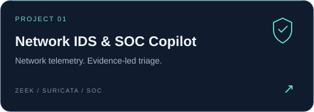
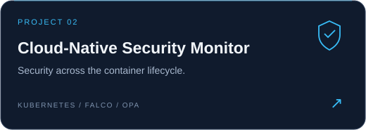
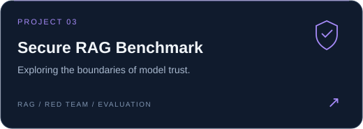
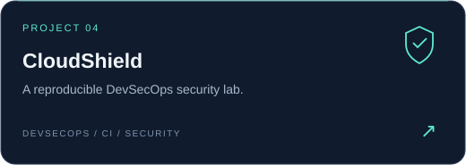
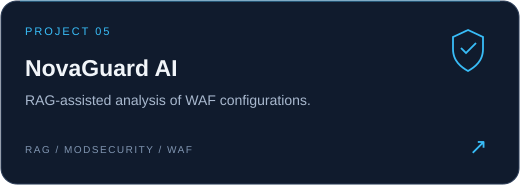
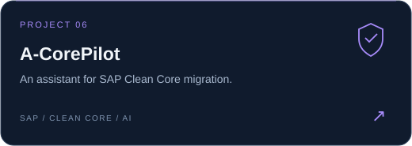

  
    
  <a href="mailto:louay.hammoudi@etudiant-enit.utm.tn"><strong>Get in touch ↗</strong></a>
  &nbsp;&nbsp;·&nbsp;&nbsp;
  <a href="https://github.com/LouayHM3?tab=repositories"><strong>Explore my work ↗</strong></a>
    
  AI &amp; cybersecurity &nbsp;/&nbsp; cloud infrastructure &nbsp;/&nbsp; networks

 

## A little about me

I'm **Louay**, a final-year **Telecommunications & Networks Engineering student at ENIT**, based in **Tunis, Tunisia**. I specialize in **Converged Infrastructures, Cloud & Cybersecurity**.

I build projects that connect intelligent software with practical security: from RAG evaluation and SOC tooling to cloud infrastructure and network observability.

- **Currently exploring** — LLM security, retrieval-grounded assistants and agentic workflows.
- **Engineering interests** — security automation, distributed systems and DevSecOps.
- **Beyond the keyboard** — two-time Tunisian national taekwondo champion and former national-team member.

 

## Selected projects

Security labs, AI prototypes and tools I'm building. Click a card to explore its source, architecture and implementation.

  
  
  
  
  
  

 

## My toolkit

| Focus | Technologies & interests |
| :--- | :--- |
| **AI & intelligent systems** | Python · TensorFlow · LLMs · RAG · Agents |
| **Security engineering** | Zeek · Suricata · ModSecurity · Trivy · Falco · OPA |
| **Cloud & delivery** | AWS · Docker · Kubernetes · Linux · Git |
| **Software & data** | JavaScript · Java · C / C++ · C# · PostgreSQL · MongoDB |
| **Observability & networks** | OpenSearch · Prometheus · Grafana · TCP/IP · Routing |

 

  <h3>Let's build something worth trusting.</h3>
  
Interested in AI, cybersecurity, cloud or network engineering? I'd be happy to connect.

  
<a href="mailto:louay.hammoudi@etudiant-enit.utm.tn"><strong>louay.hammoudi@etudiant-enit.utm.tn ↗</strong></a>

   
  Built with curiosity. Improved through practice.

